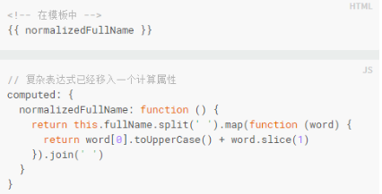

# 使用vue开发的一些注意事项

* 必要的
* 强烈推荐的做法
* 推荐
* 避免使用的一些问题

### ### 必要的

* 组件名称尽量使用 - 分割，采用多个单词组合，避免与html元素产生冲突

  **    例如 uni-app

  

* 组件data数据必须是一个函数的表达形式

  **    data(){
      	return {
         	 数据
     	 }
  	 }

  

* prop的定义尽量使用对象类型细致化，更好的定义它的数据形式

  **  props：{
      	status：{
      		type：string，
      		required：true，
      		validator:function(){
                            return[
                  	

                      ]
    			   }
    		   }
    		   name:{
                   type:string,
                   ....
    		   }
    	   }
  
* 使用v-for渲染列表时，为其绑定对应的key值，保证唯一性

  

* v-for比v-if的优先级更高，尽量避免一起使用

* 为组件样式设置作用域可以使用scoped属性或者css modules 或者bem约定（特殊的类名方式）

* 私有属性建议使用$_开头去定义，避免和vue自身属性名冲突

 

### ###强烈推荐做法

* 将组件拆分成不同的文件组成，便于我们维护和可读性

  ** 比如js和css单独拆分出来

* 单文件组件命名使用驼峰命名规则（MyComponent）或者使用横线连接（my-component）

  

* 基础组件的命名统一前缀，搭配webpack统一全局注册

* 紧密耦合的组件内：子组件使用父组件的名称做前缀

* 多个特性得到元素分行撰写，每个特性占一行

  

* 组件模板应该只包含简单的表达式，复杂的表达式则应该使用计算属性或方法

   

* 计算属性应该尽可能的分割成简单的属性，便于阅读，便于维护相关一些小的改动

* 在 HTML 中不带空格的特性值是可以没有引号的，但这鼓励了大家在特征值里*不写*空格，导致可读性变差，所以尽量的带引号，添加空格，提高可读性

  

  拒绝下面这种形式：

  

* 指令的缩写（v-on：用@表示，v-bind：用：表示）在同一个标签中，要不都缩写，要不都不要缩写，统一规则。

### ###推荐写法

* 组件/实例的选项顺序：

  el

  全局感知：name，parent

  组件类型：functional

  模板修改器：delimiters，comments

  模板依赖：components，derectives，filters

  组合：mixins，extends

  接口：inheritAttrs，model，props/propsData

  本地状态：data，computed

  事件：watch，生命周期钩子

  methods

  渲染：template/render，renderError

* 元素特性的顺序

  定义：is

  列表渲染：v-for

  条件渲染：v-if，v-else-if，v-else，v-show，v-cloak

  渲染方式：v-pre，v-once

  全局感知：id

  唯一的特性：ref，key，slot

  双向绑定：v-model

  其他特性：普通的绑定和未绑定的特性

  事件：v-on

  内容：v-text，v-html

  

* 组件/实例选项中的属性太多使用空格将其隔开，增强可读性

  

* 单文件组件的顶级元素顺序：style放在最后

  

### ###避免使用

* 没有在v-if/v-else-if/v-else中使用key：如果这几个渲染的元素类型一样，最好使用key（比如两个div）

  

* 元素选择器尽量不要出现在scoped属性中，应使用类名之类的选择器

